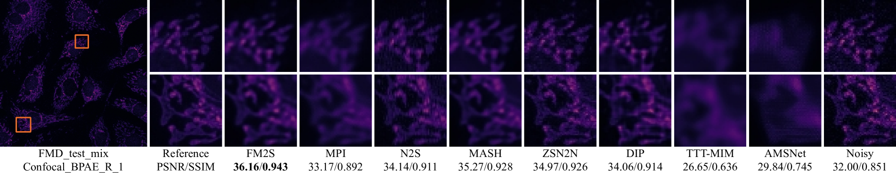
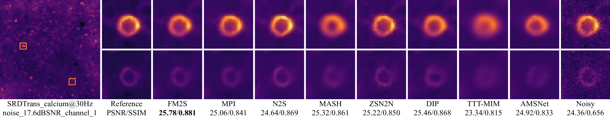

# FM2S: Towards Spatially-Correlated Noise Modeling in Zero-Shot Fluorescence Microscopy Image Denoising

[](https://arxiv.org/abs/2412.10031)
[](LICENSE)


## Abstract
Fluorescence microscopy image (FMI) denoising faces critical challenges due to the compound mixed Poisson-Gaussian noise with strong spatial correlation and the impracticality of acquiring paired noisy/clean data in dynamic biomedical scenarios. While supervised methods trained on synthetic noise (e.g., Gaussian/Poisson) suffer from out-of-distribution generalization issues, existing self-supervised approaches degrade under real FMI noise due to oversimplified noise assumptions and computationally intensive deep architectures. In this paper, we propose Fluorescence Micrograph to Self (FM2S), a zero-shot denoiser that achieves efficient FMI denoising through three key innovations: 1) A noise injection module that ensures training data sufficiency through adaptive Poisson-Gaussian synthesis while preserving spatial correlation and global statistics of FMI noise for robust model generalization; 2) A two-stage progressive learning strategy that first recovers structural priors via pre-denoised targets then refines high-frequency details through noise distribution alignment; 3) An ultra-lightweight network (3.5k parameters) enabling rapid convergence with 270× faster training and inference than SOTAs. Extensive experiments across FMI datasets demonstrate FM2S's superiority: It outperforms CVF-SID by 1.4dB PSNR on average while requiring 0.1% parameters of AP-BSN. Notably, FM2S maintains stable performance across varying noise levels, proving its practicality for microscopy platforms with diverse sensor characteristics. Code and datasets will be released.

## Visualization





## Getting Started
It is recommended to use a virtual environment.

	conda create -n FM2S python=3.9 -y
	conda activate FM2S
	pip install -r requirements.txt


## Data
Our experiment data are from the following links, and we acknowledge their work!
- FMD (Zhang et al. 2019) dataset. [yinhaoz/denoising-fluorescence](https://github.com/yinhaoz/denoising-fluorescence)

- SRDTrans (Li et al. 2023) dataset. [cabooster/SRDTrans](https://github.com/cabooster/SRDTrans)

Two subset for our experiment are in the `data` folder, one can use them to reproduce our results.


## Run
The starting program is in `main.py` and run the following command to denoise an image.

    python main.py -i data/TwoPhoton_MICE_1.png -o output.png -c twophoton

The arguments are explained as:
- **-i/--input_image_path:** The path for image to be denoised.
- **-o/--output_image_path:** The output path for the denoised image.
- **c/--config:** The microscope type of the input image. All the configurations are listed below.

<details>
<summary>FMD dataset</summary>

| Type       | HypParam | avg1 | avg2 | avg4 | avg8 | avg16 |
|------------|----------|:------:|:------:|:------:|:------:|:------:|
| **Confocal** | $\lambda$ |      |      | 2    |      |       |
|            | stride   |      |      | 75   |      |       |
|            | filter   |      |      | 3    |      |       |
|            | $k_g$      | 200  | 125  | 70   | 10   | 5     |
|            | $k_p$      | 30   | 95   | 195  | 240  | 650   |
|            | $\lambda_p$      | 70   | 285  | 485  | 650  | 1400  |
| **TwoPhoton** | $\lambda$ |      |      | 2    |      |       |
|            | stride   |      |      | 75   |      |       |
|            | filter   |      |      | 3    |      |       |
|            | $k_g$      | 175  | 150  | 90   | 20   | 15    |
|            | $k_p$      | 30   | 85   | 300  | 185  | 850   |
|            | $\lambda_p$      | 60   | 300  | 480  | 600  | 3800  |
| **WideField** | $\lambda$ | 1    |      |      |      |       |
|            | stride   |      |      | 75   |      |       |
|            | filter   |      |      | 11   |      |       |
|            | $k_g$      | 220  | 220  | 60   | 20   | 1     |
|            | $k_p$      | 45   | 100  | 650  | 600  | 1500  |
|            | $\lambda_p$      | 2000 | 2500 | 3500 | 4000 | 4800  |

</details>

<details>
<summary>SRDTrans dataset</summary>

| $\lambda$ | stride | filter | $k_g$ | $k_p$ | $\lambda_p$ |
|:---:|:------:|:------:|:------:|:------:|:------:|
|6	|5		|3	|60	|30	|150|

</details>

## Citation
```
@article{liu2024fm2s,
  title={FM2S: Towards Spatially-Correlated Noise Modeling in Zero-Shot Fluorescence Microscopy Image Denoising},
  author={Jizhihui Liu, Qixun Teng, Qing Ma, Junjun Jiang},
  journal={arXiv preprint arXiv:2412.10031},
  year={2024}
}
